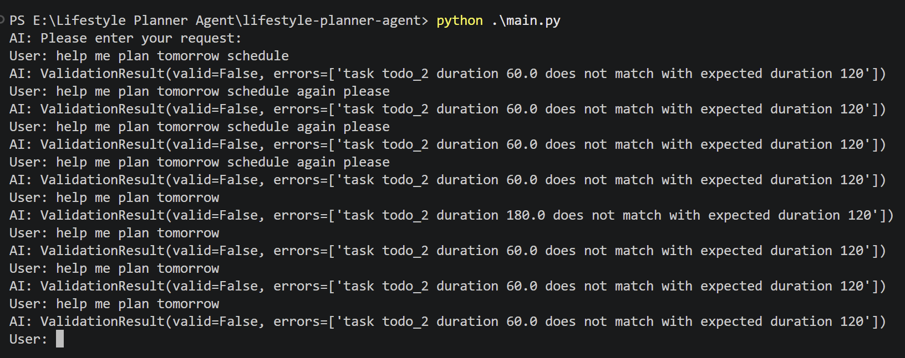

# AI Lifestyle Planner Agent

A lightweight multi-step AI agent built with OpenAI tool calling APIs.

This project demonstrates how to build a tool-using AI agent from scratch without relying on frameworks such as LangChain or LangGraph.  

The agent can:

- Reason about user requests
- Decide when tools are needed
- Execute backend tools
- Consume tool results
- Generate final recommendations
- Backend validate final plan

Current tools:

- Calendar tool
- Todo list tool
- weather tool

## Architecture
```
User Input
    ↓
LLM Reasoning
    ↓
Tool Calling
    ↓
Backend Tool Execution
    ↓
Tool Result Injection
    ↓
LLM Continues Reasoning
    ↓
Final Response
    ↓
Backend Deterministic Validation
```

## Key Features
### Multi-step Agent Loop
The agent supports iterative reasoning and tool execution within a fixed max loop count, and a fallback return message when reaching max limit.
```python
while loop_count < MAX_LOOP_COUNT:
    loop_count += 1

    response = llm.call_llm(messages, ALL_TOOLS)

    if not response.tool_calls:
        return response.content

    messages.append(response)
    for tool_call in response.tool_calls:
        
        ...

        messages.append({
            "role": "tool",
            "tool_call_id": tool_call.id,
            "content": json.dumps(tool_result)
        })
return "Sorry, I couldn't complete the request within the allowed number of steps."
```
This allows the LLM to:

1. Decide which tools are needed
2. Consume tool outputs
3. Continue reasoning
4. Optionally call more tools  
5. Generate a final response  
6. Avoid endless tool calling

## Tool Registry
Backend tools are dynamically dispatched through a tool registry:  
```python
TOOL_MAP = {
    "get_calendar_events": get_calendar_events,
    "get_todo_items": get_todo_items,
    "get_weather: get_weather
}
```

## Conversation State Management
The project manually maintains the full conversation state through the `messages` list:  
```
system prompt
user request
assistant tool-call decisions
tool execution results
assistant reasoning
tool execution results
...
final response
```
This mimics how modern AI agent runtimes manage reasoning context across multiple steps.

## Example Workflow
```
User:
Help me plan tomorrow.

LLM:
Calls calendar tool

Backend:
Executes tool and returns results

LLM:
Calls todo items tool

Backend:
Returns todo items results

LLM:
Generates final lifestyle plan

Backend:
Validates fiinal lifestyle plan
```

## Backend Deterministic Validation  
Current system validates three important metris:
- each task start and end time interval should be valid  
- each time interval should not overlap with another
- total duration time for each task should match user's todo item list

### Validation Result

From above validation result, it is obvious to see that LLM result (especially on the hard constraints) is normally not reliable. 
> **LLM is NOT source of truth**

With the validation process, we can avoid providing user with an invalid plan. However, this is a bad user experience. This brings us the next iteration plan: 
> We need to send the validation result back to LLM for revision, and validate again before handling to user.

## TODO
- Iteration 2: Deterministic Validation  
    - LLM generates structured plan
    - backend parses JSON
    - backend validates time correctness, overlap with calendar, etc.
    - if invalid, return validation error
    - (Iteration 2.1: ask LLM repair if invalid)

## Run the project
```
python main.py
```